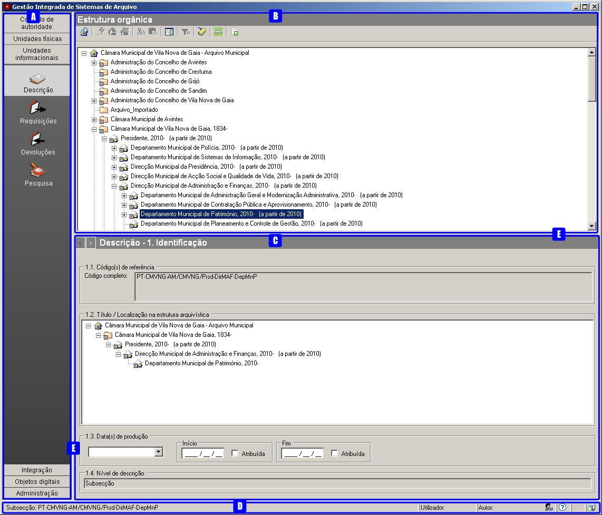

Ambiente de trabalho
====================

O interface do GISA tem essencialmente as seguintes grandes áreas no
ambiente de trabalho:

A: ``Seletor de módulos``

B: ``Área de contexto``

C: ``Área de detalhes``

D: ``Barra de estado``

E: ``Separadores vertical e horizontal``

Seletor de módulos
------------------

O ``Seletor de módulos`` permite fazer a seleção do módulo que se
pretende utilizar, bastando clicar na categoria desejada e, a seguir, no
módulo propriamente dito.

A organização dos módulos está feita da seguinte forma:

-  

   .. raw:: html

      

   Controlo de autoridade

   .. raw:: html

      

   -  

      .. raw:: html

         

      Entidade Produtora

      .. raw:: html

         

   -  

      .. raw:: html

         

      Conteúdo

      .. raw:: html

         

   -  

      .. raw:: html

         

      Tipologia Informacional

      .. raw:: html

         

\* Unidades físicas

-  

   .. raw:: html

      

   Descrição

   .. raw:: html

      

-  

   .. raw:: html

      

   Gestão de depósitos

   .. raw:: html

      

-  

   .. raw:: html

      

   Pesquisa

   .. raw:: html

      

\* Unidades informacionais

-  

   .. raw:: html

      

   Descrição

   .. raw:: html

      

-  

   .. raw:: html

      

   Requisições (A)

   .. raw:: html

      

-  

   .. raw:: html

      

   Devoluções (A)

   .. raw:: html

      

-  

   .. raw:: html

      

   Pesquisa

   .. raw:: html

      

\* Objetos digitais

-  

   .. raw:: html

      

   Fedora (A)

   .. raw:: html

      

\* Administração

-  

   .. raw:: html

      

   Configuração global

   .. raw:: html

      

-  

   .. raw:: html

      

   Grupos de utilizadores (B)

   .. raw:: html

      

-  

   .. raw:: html

      

   Utilizadores (B)

   .. raw:: html

      

-  

   .. raw:: html

      

   Permissões por Módulo (B)

   .. raw:: html

      

-  

   .. raw:: html

      

   Permissões pelo Plano de Classificação (B)

   .. raw:: html

      

-  

   .. raw:: html

      

   Estatísticas

   .. raw:: html

      

-  

   .. raw:: html

      

   Permissões por Objeto Digital (A, B)

   .. raw:: html

      

(A) Módulos opcionais

(B) Módulos inexistentes na versão monoposto

Alguns módulos acima poderão não estar disponíveis para alguns
utilizadores, pois depende das permissões definidas para cada um.

.. raw:: html

   

.. rubric:: Área de contexto
   :name: area_de_contexto
   :class: sectionedit3

.. raw:: html

   

|Área de contexto|

A ``Área de contexto`` apresenta a lista de todos os registos relativos
ao módulo selecionado e todas as ferramentas de navegação, criação,
edição, remoção, impressão, etc..

Normalmente esta área é composta por:

A: ``Título do contexto`` - Indica qual a área de contexto que está
selecionada.

B: ``Barra de ferramentas`` - Com todos os botões de comando necessários
para gerir os objetos do módulo selecionado.

C: ``Área de seleção do contexto`` - Apresenta todos os registos
relativos ao módulo selecionado, permitindo a escolha do registo que se
pretende visualizar detalhadamente, editar ou apagar.

.. raw:: html

   

.. rubric:: Barra de ferramentas
   :name: barra_de_ferramentas
   :class: sectionedit4

.. raw:: html

   

Ao parar o rato em cima de qualquer botão de comando das barras de
ferramentas, aparece uma *tooltip* com uma pequena explicação do que
esse botão faz quando se clica nele. Ao clicar num desses botões, ou se
se dá início à operação sugerida ou então aparece uma lista pendente da
qual se pode escolher uma operação das várias apresentadas. Consoante o
contexto, alguns botões podem estar inativos e as opções, apresentadas
nas listas pendentes, também.

.. raw:: html

   

.. rubric:: Área de seleção do contexto
   :name: area_de_selecao_do_contexto
   :class: sectionedit5

.. raw:: html

   

A ``Área de seleção do contexto`` apresenta a lista de registos
existentes no módulo escolhido, permitindo a navegação com a ajuda de
`ordenações </docs/ambiente_trabalho#ordenacao_de_listas>`__ e
`filtros </docs/ambiente_trabalho#filtros>`__ da lista, de forma a
facilitar a seleção do registo pretendido, seja simplesmente para
visualizar, alterar ou até mesmo apagar. As operações disponíveis na
``Barra de ferramentas`` e a informação apresentada na
``Área de detalhes``, depende do registo selecionado.

A informação apresentada nesta área, dependendo do seu tipo, pode estar
sob a forma de `lista
paginada </docs/ambiente_trabalho#listas_paginadas>`__, `lista paginada
com barra de
navegação </docs/ambiente_trabalho#listas_paginadas_com_barra_de_navegacao>`__
ou de `hierarquia de
níveis </docs/ambiente_trabalho#hierarquia_de_niveis>`__.

.. raw:: html

   

.. rubric:: Área de detalhe
   :name: area_de_detalhe
   :class: sectionedit6

.. raw:: html

   

Esta área permite mostrar ou editar todos os dados relativos a um
registo selecionado na ``Área de seleção de contexto``. Na
``Área de detalhes`` são apresentados os formulários de preenchimento do
módulo em questão, relativos ao elemento que estiver selecionado nesta
área.

|Área de detalhe|

A: ``Botões de navegação`` - Permitem navegar nos diferentes painéis de
preenchimento.

B: ``Título da área de detalhe`` - Indica a zona onde se encontra.

C: ``Barra de ferramentas`` - Zona de botões de comando, caso existam.

D: ``Área de recolha`` - Área com campos que permitem a introdução,
alteração ou visualização de dados.

A navegação entre painéis de preenchimento adjacentes pode ser feita
através dos ``Botões de navegação``. Para se “saltar” entre painéis não
adjacentes, clicar no ``Título da área de detalhe`` para poder
selecionar diretamente o painel que se pretende, através da seguinte
janela:

|Janela de navegação|

.. raw:: html

   

.. rubric:: Barra de Estado
   :name: barra_de_estado
   :class: sectionedit7

.. raw:: html

   

A barra de estado indica informações várias sobre a aplicação.

|Barra de estado|

A barra de estado, acima mostrada, é de uma versão cliente/servidor do
GISA, pois não possui o botão de ``Autor de descrição`` na posição D.

A: ``Contexto`` - Esta zona dá indicação de qual é o registo que está
selecionado na área de contexto. No caso de estar selecionado um registo
do tipo: a) *notícia de autoridade*, aparece a forma autorizada desse
registo de autoridade; b) *unidade informacional*, aparece a indicação
do tipo de nível e o código de referência do nível dessa unidade; c)
*unidade física*, mostra o código da unidade física.

B: ``Utilizador`` - Indicador do utilizador atual da aplicação.

C: ``Autor de descrição por omissão`` - Indicador do autor de descrição
que está a ser associado, por omissão, aos registos efetuados pelo
utilizador, nas diferentes áreas de recolha de dados, quando este não é
referido explicitamente.

D: ``Autor de descrição`` - Permite escolher um
``Autor de descrição por omissão``. No caso da versão monoposto, em que
o módulo de *Administração/Utilizadores* não está disponível, este botão
também permite criar ou remover autores de descrição.

E: ``Acerca de`` - Este botão permite visualizar uma janela que mostra
algumas características da aplicação: versão, entidades responsáveis e
bibliotecas utilizadas.

F: ``A guardar…`` - Indicador de quando os dados estão a ser guardados
na base de dados.

G: ``Servidor de pesquisa`` - Indicador que mostra se o servidor de
pesquisa está ou não ativo. Se estiver verde é porque está ativo, caso
contrário, está vermelho e indica que o servidor não está a responder às
pesquisas efetuadas pelo utilizador.

.. raw:: html

   

.. rubric:: Autor de descrição por omissão
   :name: autor_de_descricao_por_omissao
   :class: sectionedit8

.. raw:: html

   

A existência de um ``Autor de descrição por omissão`` é útil quando o
utilizador tem muitos registos a fazer de determinado autor, não
necessitando referi-lo em cada registo que faça. O
``Autor de descrição por omissão``, atribuído por cada utilizador,
mantém-se de sessão para sessão.

.. raw:: html

   

.. rubric:: Autor de descrição
   :name: autor_de_descricao
   :class: sectionedit9

.. raw:: html

   

O autor de uma descrição arquivística existe na medida em que o
utilizador que regista as descrições pode não ser o autor das mesmas.

O botão ``Autor de descrição`` apresentado na barra de estado de uma
versão cliente/servidor, permite atribuir ou alterar o
``Autor de descrição por omissão``. Ao clicar neste botão abre-se a
seguinte janela:

|Janela de atribuição de autor de descrição por omissão|

Os autores que aparecem na lista de autores, para preencher o campo
``Autor`` são criados no módulo *Utilizadores* da *Administração*. A
atribuição ou alteração de um autor por omissão é feita escolhendo um
autor da lista de autores existentes no sistema e clicando no botão
``Ok``.

O autor escolhido é apresentado na área
``Autor de descrição por omissão``\ (C).

Para o caso da versão monoposto, ver detalhes na subsecção seguinte
``Autores de descrição na versão monoposto``.

.. raw:: html

   

.. rubric:: Autores de descrição na versão monoposto
   :name: autores_de_descricao_na_versao_monoposto
   :class: sectionedit10

.. raw:: html

   

Na versão monoposto do GISA, como não existe o módulo *Utilizadores* na
*Administração*, os autores de descrição são criados, editados e
removidos, ao clicar no botão ``Autor de descrição`` existente na barra
de estado. A janela apresentada é a seguinte:

|Janela de criação/remoção de autores de descrição|

A: ``Criar autor`` - Botão que permite criar ou editar um autor de
descrição.

B: ``Remover autor`` - Botão que permite remover o autor de descrição
selecionado na ``Lista de autores de descrição``.

C: ``Lista de autores de descrição`` - Mostra o nome completo dos
autores de descrição criados e se cada um está ativo ou não.

D: ``Detalhes de um autor de descrição`` - Área de introdução de dados
relativos ao autor de descrição selecionado na
``Lista de autores de descrição``.

Para criar um autor de descrição, clicar no botão ``Criar autor`` e
preencher os campos da área ``Detalhe de um autor de descrição``:

-  

   .. raw:: html

      

   ``Nome``, com o nome do autor de descrição que se pretende criar.

   .. raw:: html

      

-  

   .. raw:: html

      

   ``Nome completo``, com o nome completo do autor de descrição que se
   pretende criar.

   .. raw:: html

      

-  

   .. raw:: html

      

   ``Autoridade ativa``, deve ter um visto na caixa de verificação se o
   autor de descrição está no ativo. A partir do momento que deixe de
   estar no ativo, deve retirar-se o visto para o autor deixar de
   aparecer nas listas de autores que ajudam a preencher os campos nas
   áreas de recolha de informação. Por fim clicar no botão ``Aceitar``.

   .. raw:: html

      

Para se editar um autor de descrição, selecionar o autor da
``Lista de autores de descrição`` e alterar na zona de
``Detalhe de um autor de descrição``, conforme o pretendido. Por fim,
clicar no botão ``Aceitar``.

Para remover um autor de descrição, selecionar o autor na
``Lista de autores de descrição`` e clicar no botão ``Remover autor``.
Este só será eliminado, se ainda não tiver sido usado como autor no
registo de alguma descrição. Por fim, clicar no botão ``Aceitar``.

.. raw:: html

   

.. rubric:: Acerca de
   :name: acerca_de
   :class: sectionedit11

.. raw:: html

   

Um duplo clique no botão ``Acerca de``, mostra a seguinte janela:

|Acerca de...|

Esta janela mostra algumas características da aplicação, nomeadamente,
qual a versão, quais as entidades responsáveis e as bibliotecas
utilizadas pelo executável da aplicação.

.. raw:: html

   

.. rubric:: Separadores vertical e horizontal
   :name: separadores_vertical_e_horizontal
   :class: sectionedit12

.. raw:: html

   

Estes dois separadores, vertical e horizontal, que dividem a janela
principal em três áreas, permitem ajustar a dimensão dessas áreas. Para
isso, posicionar o cursor em cima do separador e quando este tiver
assumido outra forma, premir o botão do lado esquerdo do rato e manter
pressionado enquanto se arrasta até à posição pretendida.

.. raw:: html

   

.. rubric:: Listas paginadas
   :name: listas_paginadas
   :class: sectionedit13

.. raw:: html

   

Em vários pontos da aplicação aparecem listas paginadas, onde são
apresentados os elementos de uma página de cada vez. Cada página possui
um determinado número de elementos, o qual poderá ser configurado no
módulo `Configuração global </docs/administracao#configuracao_global>`__
da *Administração*. No lado direito da lista, aparecem os botões que
permitem a navegação para outra página da lista.

|Lista paginada|

A: ``Página anterior`` - Botão que permite mostrar a página anterior.
Quando é apresentada a primeira página, este botão encontra-se inibido.

B: ``Página atual`` - Caixa de texto que indica a página atual. Permite
mostrar uma determinada página, sem ter de ser a anterior e a posterior,
ao colocar o número da página pretendido, premindo Enter de seguida.

C: ``Página seguinte`` - Botão que permite mostrar a página seguinte. Na
última página, este botão encontra-se inibido.

As listas paginadas podem ser filtradas de forma a encontrar mais
rapidamente os elementos pretendidos. Consultar a secção
`Filtros </docs/ambiente_trabalho#filtros>`__ para uma explicação mais
detalhada de como filtrar dados.

O GISA possui algumas listas que permitem ser ordenadas pelas diferentes
colunas. Para mais detalhes de como ordenar estas listas consultar a
secção `Ordenação </docs/ambiente_trabalho#ordenacao>`__ de listas desta
página.

.. raw:: html

   

.. rubric:: Listas paginadas com barra de navegação
   :name: listas_paginadas_com_barra_de_navegacao
   :class: sectionedit14

.. raw:: html

   

As listas paginadas com barra de navegação são usadas em certos pontos
da aplicação onde a informação tem uma estrutura hierárquica, permitindo
navegar pelos níveis da hierarquia.

|Lista paginada com barra de navegação|

A: ``Barra de navegação`` - A barra de navegação mostra o caminho entre
o nível selecionado e o topo. Cada nível deste caminho é uma
hiperligação que permite o posicionamento direto nesse ponto do caminho.

B: ``Lista paginada`` - Lista paginada com elementos subjacentes ao
nível selecionado na barra de navegação.

C: ``Nível de topo`` - Nível de topo da hierarquia, ou seja, a entidade
produtora à qual pertence a informação pretendida.

D: ``Nível atual`` - Nível da hierarquia atualmente selecionado.

A ``Barra de navegação`` apresenta todos os níveis que constituem o
caminho entre o ``Nível de topo`` e o ``Nível atual``. A
``Lista paginada`` mostra os níveis subjacentes ao nível selecionado na
Barra de navegação.

Para se posicionar num nível hierarquicamente inferior a um nível da
``Lista paginada``, basta dar duplo clique sobre ele. A
``Barra de navegação`` é atualizada com a adição desse nível ao caminho,
passando a ser o ``Nível atual`` e a ``Lista paginada`` passa a mostrar
os seus subníveis.

A ``Barra de navegação`` pode apresentar o seguinte aspeto quando o
caminho entre o ``Nível atual`` e o ``Nível de topo`` é grande:

|Barra de navegação|

A: ``Mostrar caminho mais à esquerda`` - Botão que mostra o caminho mais
à esquerda.

B: ``Mostrar caminho mais à direita`` - Botão que mostra o caminho mais
à direita.

C: ``Nível superior`` - Botão que permite posicionar no nível
imediatamente superior do caminho mostrado.

Para se posicionar num nível hierarquicamente superior ao
``Nível atual``, usar o botão ``Nível superior``, permitindo subir para
o nível imediatamente superior, ou então, usar as hiperligações
mostradas na barra de navegação, podendo subir diretamente para qualquer
nível do caminho. A ``Barra de navegação`` é atualizada com o nível novo
e consequentemente a ``Lista paginada`` com os seus subníveis.

Quando o caminho na barra de navegação não é completamente visível,
podem usar-se os botões ``Mostrar caminho mais à esquerda`` e
``Mostrar caminho mais à direita`` para se poder visualizar mais à
esquerda ou mais à direita.

A navegação na lista paginada é feita tal como explicado na secção
`Listas paginadas </docs/ambiente_trabalho#listas_paginadas>`__ desta
página.

.. raw:: html

   

.. rubric:: Hierarquia de níveis
   :name: hierarquia_de_niveis
   :class: sectionedit15

.. raw:: html

   

Em vários pontos da aplicação aparecem hierarquias de níveis, cuja
navegação se processa sempre da mesma forma.

|Hierarquia de níveis|

Neste caso, a navegação pelos elementos é feita de uma forma
hierárquica. Expandir um nodo, clicando no sinal +, permite visualizar
os seus nodos subjacentes. Colapsar um nodo, clicando no sinal -,
permite esconder os seus nodos subjacentes.

.. raw:: html

   

.. rubric:: Filtros
   :name: filtros
   :class: sectionedit16

.. raw:: html

   

No GISA existem filtros em vários tipos de listas para ajudar a
selecionar elementos dessas listas. Para se filtrar elementos de uma
lista, clicar no botão ``Filtrar dados`` de uma barra de ferramentas.
Por exemplo,

|Botão Filtrar dados na barra de ferramentas|

A: ``Filtrar dados`` - Botão de filtragem de dados em posição *off*.

Ao pressionar o botão ``Filtrar dados``, este fica em posição *on* e é
apresentada a ``Área de filtragem``, onde se colocam critérios.

|Área de contexto com área de filtragem ativa|

A: ``Filtrar dados`` - Botão de filtragem de dados em posição *on*.

B: ``Área de filtragem`` - Os campos de filtragem desta área, variam com
o tipo de lista onde vão atuar.

Para limitar o número de elementos da lista, colocar os critérios de
filtragem pretendidos e clicar no botão ``Aplicar`` (ou pressionar a
tecla ``Enter``) . Para se voltar a mostrar todos os elementos da lista,
apagar os critérios introduzidos e clicar no botão ``Aplicar``.

Para esconder esta ``Área de filtragem`` basta clicar novamente no botão
``Filtrar dados`` da barra de ferramentas. Deve ter-se em conta que, ao
esconder a ``Área de filtragem``, o critério de filtragem estabelecido
permanece enquanto não se mudar para outra ``Área de Contexto``.

Embora os campos de filtragem possam variar em função do tipo de lista,
o princípio de uso do filtro é exatamente o mesmo. O filtro apresentado
anteriormente filtra listas de entidades produtoras, apresentando
somente as validadas e as não validadas cuja designação começa por
*dep*.

Neste caso específico, para limitar as entidades produtoras a apresentar
na lista, podem usar-se os seguintes campos como critério de pesquisa:

-  

   .. raw:: html

      

   ``Designação`` - Este campo permite limitar a apresentação das
   entidades produtoras, cujos termos autorizados, paralelos e outros,
   obedeçam à expressão indicada.

   .. raw:: html

      

\*\ ``Notícia de autoridade`` - Neste caso só tem um tipo possível, ou
seja, *Entidade Produtora*.

-  

   .. raw:: html

      

   ``Validado`` - A caixa de verificação ``Validado`` tem três estados:
   a) *sem visto*, só visualiza os registos no controlo de autoridade
   não validados; b) *com visto a preto*, só visualiza os registos no
   controlo de autoridade validados e c) *com o visto a cinzento* (caso
   por omissão), visualiza quer os validados quer os não validados.

   .. raw:: html

      

A expressão de pesquisa deve coincidir com o campo de texto que se
pretende recuperar, podendo, no entanto, usar-se alguns caracteres
especiais:

-  

   .. raw:: html

      

   **%**, representando qualquer combinação de caracteres e

   .. raw:: html

      

**\*\_**, representando um único caracter qualquer.

A pesquisa através dos filtros não é sensível a maiúsculas nem a
diacríticos.

Por exemplo, *%administracao%* no critério, mostra todos os registos
cuja designação contenha a palavra *administração*, podendo recuperar
*Conselho de Administração*, *Relatório da Administração Central*, etc..

Por exemplo, *Lui\_ Morgado*, permite filtrar todos elementos com essa
designação em que o caracter **\_** pode ser substituído por qualquer
caracter. Então, tanto pode recuperar *Luís Morgado* como *Luiz
Morgado*.

.. raw:: html

   

.. rubric:: Ordenação de listas
   :name: ordenacao_de_listas
   :class: sectionedit17

.. raw:: html

   

O GISA tem algumas listas paginadas onde é possível ordenar os elementos
pelas colunas, conforme pretendido.

Por exemplo, a lista de resultados de uma pesquisa:

|Lista paginada sem ordenação|

Para ordenar a lista por ordem crescente da coluna ``Título`` basta
clicar em cima do cabeçalho dessa coluna. Se se pretender definir um
segundo critério de ordenação, basta clicar em cima do cabeçalho da
coluna coorespondente. No cabeçalho das colunas ordenadas aparecem
números indicando a ordem dos critérios de ordenação escolhidos e
triângulos indicando o tipo de ordem dos elementos da coluna:

|Lista paginada com ordenação ascendente usando 2 colunas|

Caso se pretenda alterar de ordem ascendente para descendente (e
vice-versa) basta clicar novamente na coluna escolhida como critério.
Por exemplo na imagem anterior, a coluna ``Título`` está por ordem
crescente, se se clicar novamente nessa coluna, passa a ordem
decrescente e o triângulo muda de direção:

|Lista paginada com ordenação descendente na 1ª coluna|

Para limpar os critérios de ordenação, clicar no cabeçalho da lista
paginada com o botão direito do rato.

.. raw:: html

   

.. raw:: html

   

.. |Ambiente de trabalho geral| image:: /docs/_media/ambientetrabalhogeral2.jpg?w=500&tok=7422ce
   :class: mediacenter
   :width: 500px
   :target: /docs/_detail/ambientetrabalhogeral2.jpg?id=ambiente_trabalho
.. |Área de contexto| image:: /docs/_media/areacontexto.jpg?w=400&tok=4c09a3
   :class: mediacenter
   :width: 400px
   :target: /docs/_detail/areacontexto.jpg?id=ambiente_trabalho
.. |Área de detalhe| image:: /docs/_media/areadetalhes.jpg?w=500&tok=618768
   :class: mediacenter
   :width: 500px
   :target: /docs/_detail/areadetalhes.jpg?id=ambiente_trabalho
.. |Janela de navegação| image:: /docs/_media/janelanavegacao.png?w=300&tok=993849
   :class: mediacenter
   :width: 300px
   :target: /docs/_detail/janelanavegacao.png?id=ambiente_trabalho
.. |Barra de estado| image:: /docs/_media/barraestado.jpg?w=550&tok=c5e18c
   :class: mediacenter
   :width: 550px
   :target: /docs/_detail/barraestado.jpg?id=ambiente_trabalho
.. |Janela de atribuição de autor de descrição por omissão| image:: /docs/_media/atribuirautoromissao.png?w=250&tok=a34d7b
   :class: mediacenter
   :width: 250px
   :target: /docs/_detail/atribuirautoromissao.png?id=ambiente_trabalho
.. |Janela de criação/remoção de autores de descrição| image:: /docs/_media/gerirautores.jpg?w=300&tok=a5cb34
   :class: mediacenter
   :width: 300px
   :target: /docs/_detail/gerirautores.jpg?id=ambiente_trabalho
.. |Acerca de...| image:: /docs/_media/acercade.png?w=400&tok=bd8d1d
   :class: mediacenter
   :width: 400px
   :target: /docs/_detail/acercade.png?id=ambiente_trabalho
.. |Lista paginada| image:: /docs/_media/listpaginada.jpg?w=500&tok=2b4a50
   :class: mediacenter
   :width: 500px
   :target: /docs/_detail/listpaginada.jpg?id=ambiente_trabalho
.. |Lista paginada com barra de navegação| image:: /docs/_media/listpaginadacomnavegacao.jpg?w=500&tok=e48c5f
   :class: mediacenter
   :width: 500px
   :target: /docs/_detail/listpaginadacomnavegacao.jpg?id=ambiente_trabalho
.. |Barra de navegação| image:: /docs/_media/barranavegacao.jpg?w=550&tok=18fd47
   :class: mediacenter
   :width: 550px
   :target: /docs/_detail/barranavegacao.jpg?id=ambiente_trabalho
.. |Hierarquia de níveis| image:: /docs/_media/hierarquianiveis.png?w=500&tok=69204b
   :class: mediacenter
   :width: 500px
   :target: /docs/_detail/hierarquianiveis.png?id=ambiente_trabalho
.. |Botão Filtrar dados na barra de ferramentas| image:: /docs/_media/botaofiltrardados.jpg?w=250&tok=0ea486
   :class: mediacenter
   :width: 250px
   :target: /docs/_detail/botaofiltrardados.jpg?id=ambiente_trabalho
.. |Área de contexto com área de filtragem ativa| image:: /docs/_media/areafiltro.jpg?w=500&tok=e169ad
   :class: mediacenter
   :width: 500px
   :target: /docs/_detail/areafiltro.jpg?id=ambiente_trabalho
.. |Lista paginada sem ordenação| image:: /docs/_media/listacomordenacao1.png?w=500&tok=518027
   :class: mediacenter
   :width: 500px
   :target: /docs/_detail/listacomordenacao1.png?id=ambiente_trabalho
.. |Lista paginada com ordenação ascendente usando 2 colunas| image:: /docs/_media/listacomordenacao2.png?w=500&tok=341efc
   :class: mediacenter
   :width: 500px
   :target: /docs/_detail/listacomordenacao2.png?id=ambiente_trabalho
.. |Lista paginada com ordenação descendente na 1ª coluna| image:: /docs/_media/listacomordenacao3.png?w=500&tok=cff950
   :class: mediacenter
   :width: 500px
   :target: /docs/_detail/listacomordenacao3.png?id=ambiente_trabalho
